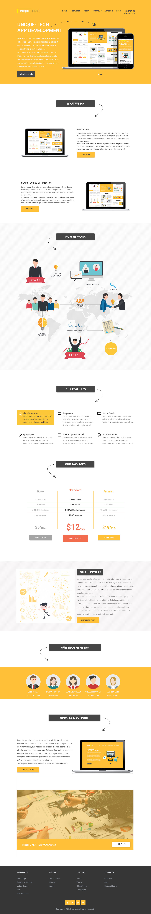

# Unique Tech Website Landing Page

Welcome to the Unique Tech Website Landing Page repository! This repository contains the front-end design for a unique and modern tech website landing page. The design is created using Bootstrap for the responsive layout and custom SASS (SCSS) for styling.

## Preview

## Technologies Used

- **Bootstrap:** The project utilizes Bootstrap for its responsive grid system and pre-built components, making it easy to create a mobile-friendly design.

- **SASS (SCSS):** Custom styling is implemented using SASS, a CSS preprocessor, to maintain a modular and organized stylesheet.

## Project Structure

- **index.html:** The main HTML file containing the structure of the landing page.

- **scss:** This directory contains the SASS source files and compiled CSS files.

- **images:** This directory stores all the images used in the project.

## How to Use

1. Clone the repository:

   `git clone https://github.com/your-username/unique-tech-website.git`
   
3. Open the index.html file in a web browser to view the landing page.

4. If you want to customize the styles, modify the SASS files in the styles directory and recompile them into CSS.
